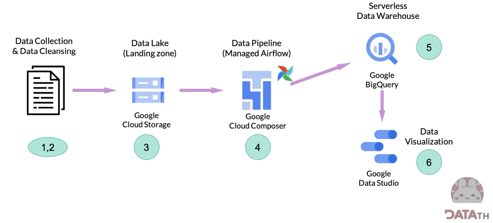

# Data Engineering Project: AudioBook Business Intelligence
This project is from [Road to Data Engineer](https://school.datath.com/courses/road-to-data-engineer-2-0-2023) course. Road to Data Engineer is a course that provides fundamental to advanced knowledge in the Data Engineer track. We can apply this knowledge to build automated data pipelines.

## Project Overview

### Stages and Technologies
1. Data Collection: Python (Google Colab), Pandas, REST API
2. Data Wrangling and Cleansing: Apache Spark (Colab and PySpark)
3. Data Storage: Google Cloud Storage (GCS)
   - Create bucket
   - Upload data
4. Automated Data Pipeline: Apache Airflow
   - Import modules
   - Define the default arguments
   - Define the DAG
   - Create tasks
   - Set the task dependencies
5. Building Data Warehouse: BigQuery (integrated with Airflow)
   - Create dataset
   - Import data
   - Explore data on BigQuery using SQL
6. Building Dashboard: Google Data Studio (data sourced from BigQuery)
   - Create table in BigQuery (if one does not already exist)
   - Create a view to provide a specific subset of data for visualization
   - Create a dashboard
